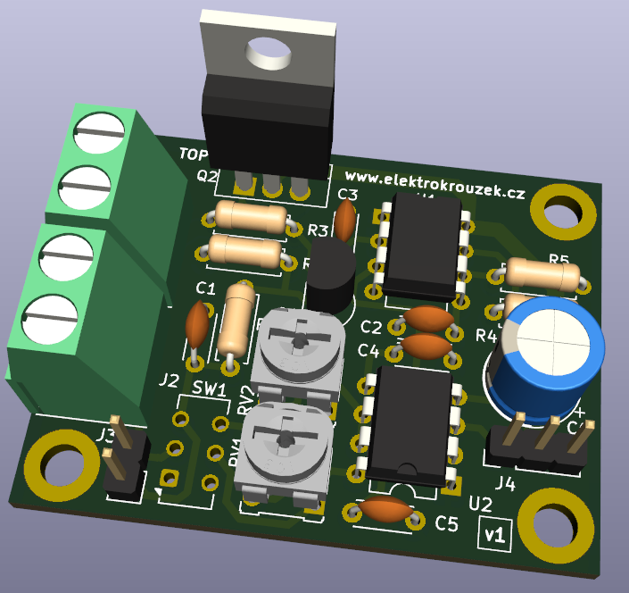

# NE555 based useless box
This is the construction of useless box based on NE555 timers. All components are
in THT packages.

PCB is 2-layer and was designed using KiCad 8. Fabrication output for JLCPCB is in gerber folder.

Happy soldering!

